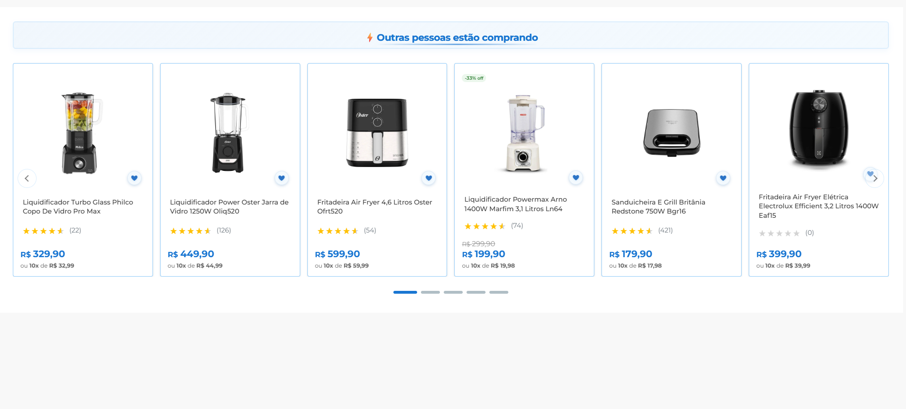

# Bem-vindo ao teste de frontend do Beonly.

Se você chegou até aqui é por que já reconhecemos que você tem perfil para fazer parte do time Beonico!

Essa etapa é importante para entendermos seu estilo de desenvolvimento e familiaridade com a stack que utilizamos.

Note que não olharemos apenas o resultado final do seu teste. Também observaremos:

- Estrutura dos arquivos, como você optou por organizar o projeto.
- Qualidade e coerência na escrita do código.
- Reaproveitamento e uso inteligente dos componentes de código.
- Bom uso do recursos das linguagens que optar por usar.

## Requisitos

Apenas dois componentes são obrigatórios na stack: SASS como pré-compilador de CSS e [Tiny Slider](https://github.com/ganlanyuan/tiny-slider/blob/master/README.md).

Além disso, sinta-se à vontade para agregar tecnologias que você acredita serem relevantes para o projeto. Isso conta ponto no quarto ponto listado acima.

## Como realizar o teste

### Faça um fork do projeto

Copie este repositório e desenvolva seu teste nesse fork. Nenhum commit ou pull request será aceito no repositório principal.

Mantenha seu fork público e nos envia o link para avaliarmos seu trabalho.

### Configure o ambiente de desenvolvimento

Note que a estrutura básica do projeto contém um HTML e algumas imagens de referência.

Você é responsável por configurar o pacote que nos enviará: instale suas dependências, configure suas automações, estruture seu projeto no diretório **./src**.****

### Execute o teste

- Escolha uma das imagens de referência.
- Estilize o HTML do arquivo sample.html para que se pareça, o máximo possível, da imagem de referência.

**IMPORTANTE**: nenhuma alteração é permitida nesse HTML, exceto aquela necessárias para carregar suas folhas de estilo. Não modifique o código-fonte.

**Nota**: o Tiny Slider já está inicializado, e as configurações de inicialização do componente podem ser modificadas. [Aqui você encontra a documentação completa](https://github.com/ganlanyuan/tiny-slider/blob/master/README.md).

### Documente seu projeto

- Atualize o README com instruções para instalar, compilar e visualizar seu projeto.
- Durante a avaliação não modificaremos nenhum arquivo. O esperado é rodar apenas linhas de comando para rodar seu projeto e visualizar no navegador.

## Boa sorte

Concentre-se e faça seu melhor. Estamos ansiosos para receber seu projeto!

### Um adendo sobre o uso de IA

Sabemos que IA pode resolver bastante coisa, e provavelmente faria esse trabalho por você em poucos minutos. Não é proibido o uso de IA, desde que você deixe explícito onde e como utilizou essas ferramentas. No entanto, lembre-se: não é só seu código que será avaliado, e usar IA não te permitirá mostrar qualidades importantes de um programador e que são importantes para nós, como: entender e resolver problemas, propor soluções criativas e otimizadas, extrapolar o escopo com foco no objetivo final.


## Como iniciar o projeto

Para iniciar o projeto, execute os seguintes comandos:

1. Instale as dependências:
```
npm install
```

2. Execute o SASS para compilar os estilos (deixe este terminal aberto):
```
npm run sass
```

3. Em outro terminal, inicie o servidor de desenvolvimento para visualizar no navegador:
```
npm run dev
```

O projeto estará disponível no navegador através do servidor local iniciado pelo `live-server`.

## Resultado Esperado

Abaixo está uma captura de tela mostrando como o projeto ficou após a implementação:



### Descrição do Resultado

O projeto implementa um carousel de produtos com o título "Outras pessoas estão comprando", exibindo cards de produtos com as seguintes características:

- **Cards de Produtos**: Cada card exibe a imagem do produto, nome, avaliação com estrelas, número de reviews, preço e opção de parcelamento
- **Sistema de Favoritos**: Ícone de coração em cada produto para adicionar/remover dos favoritos
- **Tags de Desconto**: Produtos em promoção exibem uma tag verde com a porcentagem de desconto
- **Navegação**: Setas laterais para navegar entre os produtos e indicadores de paginação abaixo do carousel
- **Design Responsivo**: Layout adaptável que mantém a qualidade visual em diferentes tamanhos de tela

## Funcionalidades Implementadas

### Sistema de Favoritos com LocalStorage

O projeto inclui um sistema de favoritos que utiliza o `localStorage` do navegador para persistir as preferências do usuário:

- **Persistência**: Os produtos favoritados são salvos automaticamente no `localStorage` do navegador
- **Chave de armazenamento**: `'wishlist'` - armazena um array de IDs dos produtos favoritados
- **Comportamento**: 
  - Ao clicar no coração de um produto, ele é adicionado/removido da lista de favoritos
  - O estado visual do coração (ativo/inativo) é mantido mesmo após recarregar a página
  - Os favoritos são específicos por navegador e dispositivo

### Sistema de Avaliações com Estrelas

Implementação de um sistema visual de avaliações que converte notas numéricas em representação de estrelas:

- **Renderização**: Converte notas de 0-5 em estrelas preenchidas, meio preenchidas ou vazias
- **Integração**: Busca automaticamente elementos com a classe `.detail-notaMedia` e cria a visualização
- **Contagem de Reviews**: Exibe o número de avaliações ao lado das estrelas

### Tecnologias Utilizadas

- **SASS**: Pré-processador CSS para organização modular e variáveis
- **Tiny Slider**: Biblioteca para carousel de produtos
- **ES6 Modules**: Sistema de módulos JavaScript para organização do código
- **Jest**: Framework de testes unitários
- **Babel**: Transpilador para compatibilidade com Node.js nos testes
- **Live Server**: Servidor de desenvolvimento com hot reload

#### Testes Unitários

Implementação de testes focados no módulo `wishlist.js` que contém a lógica de negócio:
- Testes de todas as funções principais
- Testes de integração do fluxo completo
- Mock do localStorage para isolamento dos testes

O projeto inclui testes unitários utilizando Jest. Para executar os testes:

```bash
# Executar todos os testes
npm test

# Executar testes em modo watch (re-executa ao salvar arquivos)
npm run test:watch

# Executar testes com cobertura de código
npm run test:coverage
```

### Cobertura de Testes

Os testes cobrem:
- ✅ Funções de manipulação do localStorage (`getWishlist`, `saveWishlist`)
- ✅ Adição e remoção de itens da wishlist
- ✅ Verificação de existência de itens
- ✅ Tratamento de erros (JSON inválido, erros de storage)
- ✅ Prevenção de duplicatas
- ✅ Fluxo completo de integração

### Estrutura dos Testes

Os testes estão organizados em suites que cobrem:
- **getWishlist**: Testes de leitura do localStorage
- **saveWishlist**: Testes de escrita no localStorage
- **addToWishlist**: Testes de adição de itens
- **removeFromWishlist**: Testes de remoção de itens
- **isInWishlist**: Testes de verificação
- **Integration tests**: Testes do fluxo completo

## Scripts Disponíveis
- `npm run sass`: Compila e observa mudanças nos arquivos SCSS
- `npm run dev`: Inicia servidor de desenvolvimento com live reload
- `npm test`: Executa testes unitários
- `npm run test:watch`: Executa testes em modo watch
- `npm run test:coverage`: Executa testes e gera relatório de cobertura

## Padrões de Código

### JavaScript

- **Comentários**: Todos os comentários estão em inglês para padronização
- **JSDoc**: Funções documentadas com JSDoc para melhor autocomplete e documentação
- **ES6+**: Uso de arrow functions, const/let, template literals, destructuring quando apropriado
- **Sem console.log em produção**: Apenas `console.error` para erros críticos

### SCSS

- **Modularidade**: Estilos organizados em arquivos separados por responsabilidade
- **Variáveis**: Cores e valores reutilizáveis definidos em `_variables.scss`
- **BEM**: Convenção de nomenclatura BEM para classes CSS
- **Responsividade**: Media queries organizadas em arquivo dedicado

## Melhorias Futuras Sugeridas

- [ ] Sincronização de wishlist entre abas usando `storage` event
- [ ] Adicionar mais breakpoints responsivos (tablets, telas grandes)
- [ ] Implementar build process para minificação e otimização
- [ ] Adicionar testes para funções de manipulação do DOM
- [ ] Melhorar acessibilidade (aria-labels, keyboard navigation)
- [ ] Implementar feedback visual para erros (toast notifications)